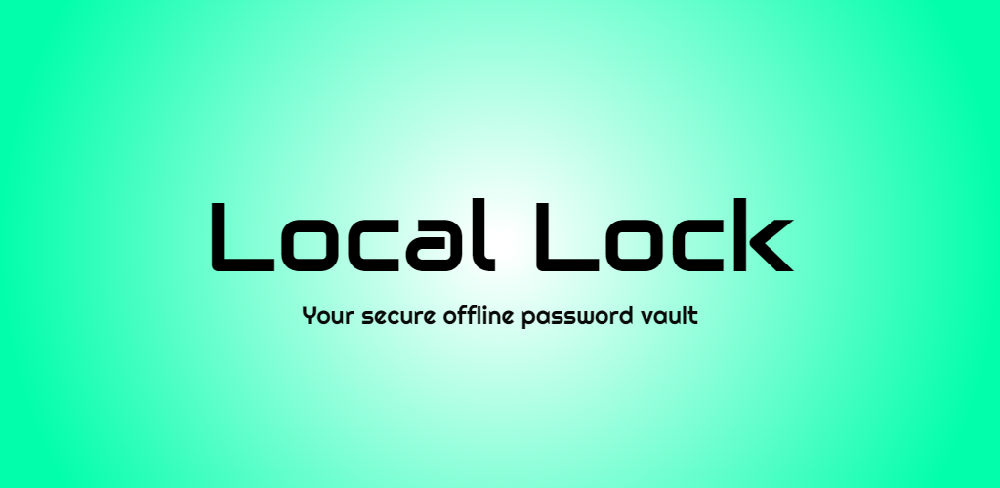
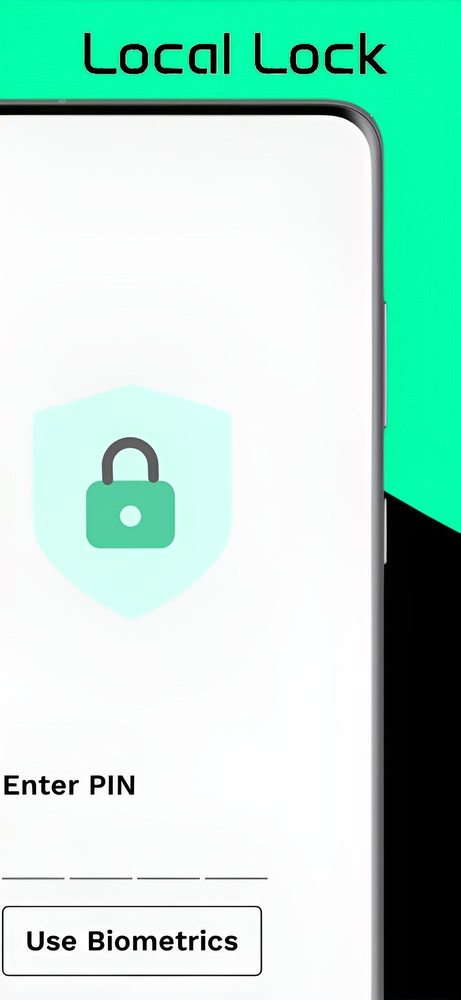
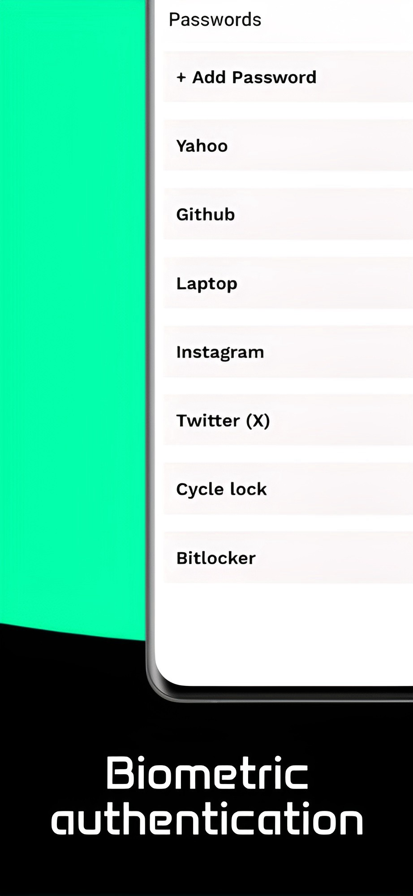
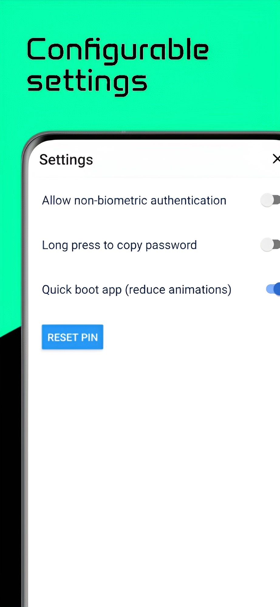

# LocalLock

LocalLock is an Android app with the only goal of being a secure, locked, no-third party, completely local open source password saving app


## Features

- Easy to use simple UI
- Bio-metric authentication (required)
- All data is stored locally
- No third party integration (no ads, no tracking, no analytics)
- Works offline
- Secure with a lock screen PIN optionally
- Passwords are encrypted using AES-256 before being stored
- PIN based authentication
- Easily copy passwords to clipboard
- Easily reset PIN if forgotten

## Screenshots

<p float="left">
    
    
    
    
    
</p>

## Installation

You can install LocalLock using npm or yarn:

```bash
npm install
# or
yarn install
```

## Usage

> Expo is required to run LocalLock. If you don't have Expo installed, you can install it using the following command:

```bash
npm install -g expo-cli
# or
yarn global add expo-cli
```

To run LocalLock, use the following command:

```bash
npm start
# or
yarn start
```

## License

LocalLock is not licensed for public or commercial use. You may use the source code for educational purposes only.

## Credits

Idea: This was made for my father who wanted to store less important passwords which change frequently more securely

Animation credits: Lock animation inspired by [Pathange Balaji Rao](https://lottiefiles.com/balajirao)