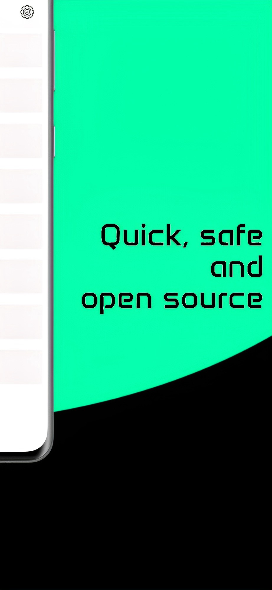

<div style="display: inline-block"  align="center">
<h1>Local Lock</h1>
<p>

<br />
<!-- <a href="https://devlibrary.withgoogle.com/products/android/repos/">

</a> -->
 <a href="https://github.com/PriyavKaneria/LocalLock/releases/download/v0.6.1/application.apk">

</a>

<br />


</p>
</div>

LocalLock is an Android app with the only goal of being a secure, locked, no-third party, completely local open source password saving app

Playstore link - https://play.google.com/store/apps/details?id=com.diginova.locallock

## 🤩 Features

- [x] Easy to use simple UI
- [x] Bio-metric authentication (required)
- [x] All data is stored locally
- [x] No third party integration (no ads, no tracking, no analytics)
- [x] Works offline
- [x] Secure with a lock screen PIN optionally
- [x] Passwords are encrypted using AES-256 before being stored
- [x] PIN based authentication
- [x] Easily copy passwords to clipboard
- [x] Easily reset PIN if forgotten

## 🛠️ New and Upcoming features

- [x] Dark mode
- [x] Additional fields to store notes
- [x] Onboarding tour
  - [x] ? icon for on demand help
- [ ] QR code based device to device offline sync
- [ ] Encrypted export for backup and restore via import

## Screenshots

<p float="left">
    
    
    
    
    
</p>

## ✍️ Author

👤 **Priyav K Kaneria**

* Twitter: <a href="https://twitter.com/_diginova" target="_blank">@_diginova</a>
* LinkedIn: <a href="https://www.linkedin.com/in/priyavkaneria" target="_blank">@PriyavKaneria</a>
* Email: priyavkaneria@gmail.com

Feel free to ping me 😉

## 🤝 Contributing

Contributions are what make the open-source community such an amazing place to learn, inspire, and create. Any
contributions you make are **greatly appreciated**.

1. Open an issue first to discuss what you would like to change.
1. Fork the Project
1. Create your feature branch (`git checkout -b feature/amazing-feature`)
1. Commit your changes (`git commit -m 'Add some amazing feature'`)
1. Push to the branch (`git push origin feature/amazing-feature`)
1. Open a pull request

Please make sure to update tests as appropriate.

## ❤ Show your support

Give a ⭐️ if this project helped you!

## 🧑‍💻 Installation

You can install LocalLock using npm or yarn:

```bash
npm install
# or
yarn install
```

## Usage

> Expo is required to run LocalLock. If you don't have Expo installed, you can install it using the following command:

```bash
npm install -g expo-cli
# or
yarn global add expo-cli
```

To run LocalLock, use the following command:

```bash
npm start
# or
yarn start
```

## License

LocalLock is not licensed for public or commercial use. You may use the source code for educational purposes only.

## Credits

Idea: This was made for my father who wanted to store less important passwords which change frequently more securely

Animation credits: Lock animation inspired by [Pathange Balaji Rao](https://lottiefiles.com/balajirao)
